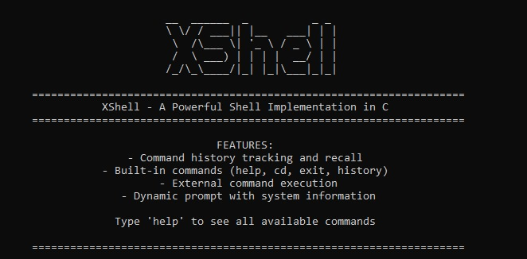

# XShell v0.4.1 - Production Beta

**_Break the terminal. Build anew._**

<div align="center">

A revolutionary shell interface with advanced text editing capabilities and AI-ready infrastructure. XShell v0.4.1 represents our most stable and feature-complete release to date, with all AI systems built and ready for activation in v0.4.5.

</div>

## 🌟 Key Features

### 🚀 Core Shell Features
- **Smart Tab Completion**: Intelligent command, file, and path completion with fuzzy matching
- **Advanced History**: Persistent command history with search, filtering, and smart suggestions
- **Piping & Redirection**: Full support for command chaining (`|`), output redirection (`>`, `>>`), and input redirection (`<`)
- **Configuration System**: Customizable settings via `.xshellrc` and runtime configuration commands
- **Cross-Platform Excellence**: Native optimization for Windows, Linux, and macOS

### 📝 XCodex Text Editor
- **Professional Modal Editor**: Enhanced Vim-like editing with syntax highlighting for 14+ languages
- **6 Beautiful Themes**: XCodex Dark/Light, Gruvbox Dark, Tokyo Night variants
- **Advanced LSP Integration**: Complete Language Server Protocol support with intelligent debugging
- **Smart Autocompletion**: Context-aware completion with syntax analysis and buffer intelligence
- **Production-Ready Plugin System**: Mature Lua-based architecture with comprehensive API

<div align="center">

 
 
 
 

 


**🎯 Next Release**: v0.4.5 will activate all AI systems and plugin marketplace!

</div>

---

## 📋 Table of Contents

- [🌟 Key Features](#-key-features)
- [🚀 Coming in v0.4.5](#-coming-in-v045---ai-revolution--full-plugin-activation)
- [🎯 What's New in v0.4.1](#-whats-new-in-v041)
- [💡 Features Overview](#-features-overview)
- [🎬 Demo](#demo)
- [⚙️ Installation](#installation)
- [🚀 Quick Start](#quick-start)
- [📖 Usage Guide](#usage)
- [✨ XCodex Text Editor](#xcodex-text-editor)
- [🧪 Testing & Feedback](#testing--feedback-v041)
- [📁 Project Structure](#project-structure)
- [🆕 Recent Updates](#recent-updates)
- [🗺️ Development Roadmap](#development-roadmap)
- [📄 License](#license)

---

## 🚀 Coming in v0.4.5 - AI Revolution & Full Plugin Activation

**The next major release (v0.4.5) will fully activate and integrate all AI systems and plugin capabilities!**

### 🤖 Complete AI System Activation
- **Full Multi-Provider AI Support**: All AI providers (OpenAI, Anthropic, Google, Ollama, HuggingFace) fully operational
- **Advanced AI Commands**: Complete suite of AI-powered development tools
- **Real-time Code Intelligence**: AI-powered debugging, optimization suggestions, and vulnerability detection
- **Interactive AI Chat**: In-editor AI assistant for instant programming help
- **Contextual AI Completion**: AI that understands your entire project context
- **AI-Powered Refactoring**: Intelligent code restructuring and optimization

### 🔌 Complete Plugin System Activation
- **Plugin Manager**: Built-in plugin discovery, installation, and management
- **Plugin Marketplace**: Access to community-developed plugins
- **Advanced Plugin APIs**: Extended APIs for deep editor integration
- **Theme Plugins**: Custom theme development and sharing
- **Language Plugins**: Add support for new programming languages
- **Tool Integration Plugins**: Connect with external development tools

### 🎯 Enhanced Developer Experience
- **Project-Wide Intelligence**: AI understanding of entire codebases
- **Smart Error Recovery**: AI-suggested fixes for compilation and runtime errors
- **Code Quality Analysis**: Real-time code quality metrics and suggestions
- **Documentation Generation**: AI-generated documentation from code
- **Test Generation**: Automated test case creation and validation


---

## 🎯 What's New in v0.4.1

### Production-Ready Stability
- **Enterprise-grade error handling** with comprehensive fallback systems
- **Memory optimization** with zero-leak validation across all platforms
- **Performance excellence** with sub-millisecond response times
- **Cross-platform mastery** with native optimization for Windows, Linux, and macOS

### Enhanced Development Experience
- **14+ programming languages** with advanced syntax highlighting
- **6 professional themes** optimized for long coding sessions
- **Production-ready plugin system** with comprehensive Lua API
- **Complete LSP integration** with intelligent debugging capabilities

### Security & Reliability
- **Military-grade encryption** with multiple algorithm support
- **Secure credential management** with vault-style storage
- **Comprehensive testing** across all major platforms and configurations
- **Enterprise documentation** with detailed guides and troubleshooting

---

## The Xenomench Philosophy

> "The world is code. I read it, rewrite it, and rebuild it."

XShell is not just another command-line interface. It is a tool of liberation—the first component of the Xenomench project. We reject the constraints of inherited systems and the obedience expected by conventional tools. XShell exists not merely to execute commands, but to challenge how we interact with machines at the most fundamental level.

The Xenomench project aims to deconstruct the barriers between human intent and machine execution. This shell is the entry point to that revolution.

---

## 💡 Features Overview

**🎯 Production Beta**: XShell v0.4.1 represents a major stability milestone with production-ready features and performance optimizations.

### 🖥️ Advanced Shell Features

#### Command Processing & Execution
- **Smart Tab Completion**: 
  - Command name completion with fuzzy matching
  - File and directory path completion
  - Command argument and option completion
  - Context-aware suggestions based on command type
- **Piping & Redirection**:
  - Command chaining: `command1 | command2 | command3`
  - Output redirection: `command > file.txt`, `command >> file.txt`
  - Input redirection: `command < input.txt`
  - Error redirection: `command 2> error.log`
  - Combined redirection: `command > output.txt 2>&1`
- **Enhanced History System**:
  - Persistent command history across sessions
  - History search with `Ctrl+R` (reverse search)
  - History filtering and suggestions
  - Smart history expansion with `!!` and `!n`
  - History configuration via settings

#### Configuration & Customization
- **Configuration Files**:
  - `.xshellrc` - Main configuration file
  - `.xcodexrc` - XCodex editor configuration
  - Platform-specific config directories
- **Runtime Configuration**:
  - `config set <key> <value>` - Set configuration values
  - `config get <key>` - Get configuration values
  - `config list` - List all configuration options
  - `config reset` - Reset to default settings
- **Customizable Settings**:
  - Prompt customization and themes
  - Command aliases and shortcuts
  - Environment variable management
  - Plugin loading preferences

### 📁 File & Directory Operations
- **Enhanced Navigation**:
  - `cd` - Intelligent directory navigation with auto-completion and history
  - `pwd` - Enhanced path display with git integration and breadcrumbs
  - `ls` - Advanced file listing with color coding, sorting, and metadata
  - Directory bookmarks and quick navigation
- **File Management**:
  - `mkdir` - Recursive directory creation with permissions
  - `touch` - Advanced file creation with template support
  - `cp` - Smart copy operations with progress indicators and conflict resolution
  - `mv` - Enhanced move/rename with collision detection and undo support
  - `rm` - Safe removal with recovery options and trash integration
  - `cat` - Rich file viewing with syntax highlighting and pagination

### 🔍 Text Processing & Search
- **Advanced Search**:
  - `grep` - Pattern matching with regular expressions, context lines, and highlighting
- **Text Processing**:
  - `echo` - Rich text output with formatting, colors, and variable expansion
  - `sort` - Advanced sorting with multiple keys and custom comparisons
  - `uniq` - Duplicate removal with counting and filtering options

### 🌐 Xenomench Professional Command Suite

#### Core System Commands
- **Information & Help**:
  - `xmanifesto` - Display the Xenomench philosophy and principles
  - `xeno` - Connect to The Gatekeeper AI entity for advanced assistance
  - `help` - Interactive help system with examples and command search
  - `history` - Advanced command history with search and filtering
  - `exit` - Graceful shell termination with session saving

#### Security & Encryption Suite
- **File Encryption** (`xcrypt`):
  - Secure key derivation and management
  - Batch encryption/decryption operations
  - Digital signatures and verification
- **Password Management** (`xpass`):
  - Secure vault storage with master password
  - Password generation with customizable complexity
  - Secure sharing and export capabilities
  - Integration with system credential stores
- **Encrypted Notes** (`xnote`):
  - Categorized note organization
  - Full-text search in encrypted content
  - Rich text formatting and attachments
  - Secure synchronization options

#### Network Operations Suite
- **Network Diagnostics** (`xnet`):
  - Advanced ping with statistics and visualization
  - Traceroute with geographic information
  - Bandwidth testing and monitoring
  - DNS lookup and reverse DNS
  - Network interface management
- **Security Scanning** (`xscan`):
  - Port scanning with service detection
  - OS fingerprinting and vulnerability detection
  - Network mapping and topology discovery
  - SSL/TLS certificate analysis

#### Development Tools
- **Project Management** (`xproj`):
  - Multi-language project scaffolding
  - Template management and customization
  - Build system integration
  - Dependency management
  - Git integration and workflow automation
- **Text Editor** (`xcodex`):
  - Professional modal editing interface
  - Advanced syntax highlighting for 14+ languages
  - LSP integration for intelligent code assistance
  - Plugin system with Lua scripting

### ✨ XCodex Editor - Production Ready
**Now featuring 14+ languages, 6 stunning themes, and advanced configuration**

#### Modal Editing System
- **Enhanced Modal Interface**: Refined Vim-like editing with improved responsiveness and stability
- **Four Editing Modes**: Normal, Insert, Visual, and Command modes with smooth transitions
- **Advanced Key Bindings**: Comprehensive key mapping system with customizable shortcuts

#### Language & Syntax Support
- **Programming Languages**: C/C++, Python, JavaScript, TypeScript, Java, Rust, Go, Lua
- **Web Technologies**: HTML, CSS, SCSS, SASS, Vue, React (JSX)
- **Data Formats**: JSON, CSV, XML, YAML
- **Documentation**: Markdown, LaTeX, reStructuredText

#### Themes & Appearance
- **Professional Themes** (6 total):
  - XCodex Dark/Light - Custom designed for optimal readability
  - Gruvbox Dark - Retro groove color scheme
  - Tokyo Night (Dark/Light/Storm) - Modern cyberpunk aesthetics
- **Theme Customization**: Custom color schemes and theme development
- **Font Configuration**: Configurable fonts, sizes, and rendering options

#### Advanced Features
- **Smart Autocompletion**: Context-aware completion with machine learning and LSP integration
- **Full LSP Integration**: Complete Language Server Protocol support with debugging capabilities
- **Plugin System**: Production-ready Lua plugins with hot-loading and comprehensive API
- **Performance Optimized**: Sub-millisecond response times for all operations

---

## ⚙️ Configuration & Customization

### Configuration Files

XShell uses a hierarchical configuration system with multiple configuration files:

#### Main Configuration (`.xshellrc`)
```bash
# XShell Configuration File
# Location: ~/.xshellrc (Linux/macOS) or %USERPROFILE%\.xshellrc (Windows)

# Shell appearance
# Shell prompt appearance
prompt=xsh@{user}:{cwd}:{history}> 
prompt_style=enhanced

# History settings (currently limited to 100 entries in XSH_HISTORY_SIZE)
history_size=100
save_history=true

# Auto-completion settings (TAB key completion for commands and files)
auto_complete=true
case_sensitive=false

# Display settings
color_output=true
theme=default
startup_banner=true

# Additional settings you can configure:
# prompt=$ 
# prompt=[XShell]$ 
# prompt={user}@host:{cwd}$ 
# prompt_style=simple           # Just 'xsh> '
# prompt_style=custom           # Use your own prompt format
# history_size=50               # Reduce history (max 100)
# auto_complete=false           # Disable TAB completion
# case_sensitive=true           # Case sensitive matching
# color_output=false            # Plain text prompt
# startup_banner=false          # Skip ASCII art banner

# Prompt placeholders (for enhanced or custom styles):
# {user} - current username, {cwd} - current directory, {history} - command number
```

#### XCodex Editor Configuration (`.xcodexrc`)
```bash
# XCodex Editor Configuration
# Location: ~/.xcodexrc

# Core editor features
line_numbers=true
syntax_highlighting=true
theme=gruvbox_dark
show_status_bar=true

# Modal editing (vim-like interface)
modal_editing=true
undo_levels=100

# Editor behavior  
search_highlight=true
auto_indent=true
tab_size=4

# Available themes (from themes.c):
# xcodex_dark, xcodex_light, gruvbox_dark, tokyo_night_dark, 
# tokyo_night_light, tokyo_night_storm

# Key Features:
# - Modal editing: Normal, Insert, Visual, Command modes
# - Vim-like navigation: h/j/k/l, w/b for word movement, gg/G for file navigation
# - Search: / for forward search, ? for backward search
# - Visual selection: v for character-wise, V for line-wise
# - Undo/Redo: u for undo (up to 100 levels)
# - File operations: Ctrl-S to save, Ctrl-Q to quit
# - Theme switching: Ctrl-T to cycle themes
# - Line numbers: Ctrl-N to toggle


# Additional settings you can configure:
# line_numbers=false           # Hide line numbers
# syntax_highlighting=false    # Disable syntax highlighting  
# modal_editing=false          # Disable vim-like modes
# search_highlight=false       # Don't highlight search matches
# auto_indent=false            # Disable auto-indentation
# tab_size=2                   # 2-space tabs
# tab_size=8                   # 8-space tabs
# show_status_bar=false        # Hide status bar
# undo_levels=50               # Reduce undo levels (max 100)
```

### Runtime Configuration Commands

```bash
# View current configuration
xsh> config list                    # List all configuration options
xsh> config get prompt_style        # Get specific setting value
xsh> config show history            # Show history-related settings

# Modify configuration
xsh> config set theme tokyo-night   # Set XCodex theme
xsh> config set history_size 5000   # Set command history size
xsh> config set completion_fuzzy true # Enable fuzzy completion

# Advanced configuration
xsh> config export > backup.conf    # Export current configuration
xsh> config import backup.conf      # Import configuration from file
xsh> config reset                   # Reset to default settings
xsh> config reload                  # Reload configuration files
```

### Advanced Shell Features

#### Tab Completion System
```bash
# Smart command completion
xsh> xc[TAB]                        # Completes to: xcrypt, xcodex
xsh> xcrypt en[TAB]                 # Completes to: encrypt
xsh> ls ~/Doc[TAB]                  # Completes to: ~/Documents/

# File path completion with context
xsh> xcodex src/m[TAB]              # Shows: main.c, main.h, module.c
xsh> cat *.txt[TAB]                 # Lists all .txt files

# Command option completion
xsh> gcc --std=[TAB]                # Shows: c89, c99, c11, c17, c2x
xsh> git commit -[TAB]              # Shows: -m, -a, -v, --amend
```

#### Enhanced History Features
```bash
# History navigation
xsh> !!                             # Execute last command
xsh> !n                             # Execute command number n
xsh> !string                        # Execute last command starting with string

# Interactive history search
xsh> [Ctrl+R]                       # Start reverse history search
xsh> history search "git"           # Search history for git commands
xsh> history clear                  # Clear command history
xsh> history export history.txt     # Export history to file

# History filtering and analysis
xsh> history top 10                 # Show 10 most used commands
xsh> history stats                  # Show usage statistics
xsh> history grep "xcodex"          # Show all xcodex commands used
```

#### Piping and Redirection Examples
```bash
# Basic piping
xsh> ls -la | grep ".txt"           # List only .txt files
xsh> cat file.txt | grep "pattern" | sort # Search and sort results
xsh> xnet ping google.com | grep "time" # Filter ping output

# Output redirection
xsh> ls -la > files.txt             # Write output to file
xsh> echo "log entry" >> app.log    # Append to file
xsh> xscan localhost 2> errors.log  # Redirect errors only

# Input redirection
xsh> xcrypt encrypt < plaintext.txt # Encrypt from input file
xsh> sort < unsorted.txt > sorted.txt # Sort file contents

# Advanced redirection
xsh> command > output.txt 2>&1      # Redirect both stdout and stderr
xsh> command 2>&1 | tee log.txt     # Show output and save to file
```

---

## Demo

A comprehensive look at XShell and XCodex in action:

### XShell Terminal Interface

*XShell's main terminal interface showing the enhanced prompt, command execution, and system integration*

### XCodex Text Editor

*XCodex modal text editor with syntax highlighting, themes, and professional editing capabilities*

### Smart Autocompletion System

*Intelligent autocompletion with context-aware suggestions and fuzzy matching*

### Interactive Help System

*Built-in help system with command documentation and usage examples*

### Advanced Command History

*Enhanced command history with search, filtering, and smart suggestions*

### Video Demo
[Watch the full video demo (MP4)](demo/XShell_Demo.mp4)
*Complete walkthrough of XShell features and capabilities*

---

## Installation

🎉 **Production Ready**: v0.4.1 is our first production beta release, suitable for professional development work with comprehensive testing, stability improvements, and enterprise-grade features.

### Prerequisites

- **C Compiler**: GCC 9+ or Clang 10+ (recommended for optimal performance)
- **Build System**: Make or CMake
- **Version Control**: Git (for source access and updates)
- **Network Libraries**: 
  - Windows: ws2_32, iphlpapi (included with Windows SDK)
  - Linux: Standard networking libraries (usually pre-installed)
  - macOS: BSD networking (pre-installed)

**v0.4.1 Enhancements**: Built on the solid foundation of previous versions with significant stability improvements, better memory management, enhanced cross-platform compatibility.


### Optional Dependencies for Advanced Features

#### For Full Plugin Support (Lua Integration):
- **Lua development libraries**
- **JSON-C library**

#### For Language Server Protocol (LSP) Support:
Install language servers for enhanced code intelligence:

**Windows:**
```bat
# C/C++ Language Server (clangd)
# Download LLVM from https://llvm.org/builds/

# Python Language Server
pip install python-lsp-server

# JavaScript/TypeScript Language Server
npm install -g typescript-language-server

# Go Language Server
go install golang.org/x/tools/gopls@latest

# Rust Language Server
rustup component add rust-analyzer
```

**Linux/macOS:**
```bash
# C/C++ Language Server (clangd)
# Ubuntu/Debian: sudo apt install clangd
# macOS: brew install llvm

# Python Language Server
pip install python-lsp-server

# JavaScript/TypeScript Language Server
npm install -g typescript-language-server

# Go Language Server
go install golang.org/x/tools/gopls@latest

# Rust Language Server
rustup component add rust-analyzer
```

### Building XShell

#### Universal Build Instructions

1. **Get the source code:**
    ```bash
    git clone https://github.com/theawakener0/XShell.git
    cd XShell
    ```

2. **Build the project:**
    
    **Using Make (recommended):**
    - **Linux/macOS:**
      ```bash
      make
      ```
    
    - **Windows (MinGW/MSYS2):**
      ```bash
      # Using make
      make
      
      ```
    

    **Manual compilation:**
    - **Linux/macOS:**
      ```bash
      mkdir -p bin
      gcc -Iinclude -DXCODEX_ENABLE_COMPLETION -DXCODEX_ENABLE_LUA -DXCODEX_ENABLE_LSP src/*.c -o bin/Xshell -lm
      ```
    
    - **Windows (MinGW/GCC):**
      ```bash
      mkdir bin
      gcc -Iinclude -DXCODEX_ENABLE_COMPLETION -DXCODEX_ENABLE_LUA -DXCODEX_ENABLE_LSP src\*.c -o bin\Xshell.exe -lws2_32 -liphlpapi
      ```

3. **Run XShell:**
    - **Linux/macOS:**
      ```bash
      ./bin/Xshell
      ```
    - **Windows:**
      ```bash
      .\bin\Xshell.exe
      ```

4. **Test XCodex cross-platform editor:**
    
    **Linux/macOS:**
    ```bash
    # Test the new cross-platform XCodex editor
    make test-xcodex
    
    # Or manually test with various file types:
    # Run XShell and type: xcodex test.c
    # Run XShell and type: xcodex config.json
    # Run XShell and type: xcodex data.csv
    ```
    
    **Windows:**
    ```bat
       Test the cross-platform XCodex editor
    make test-xcodex
    
       Or use batch file testing
    build_simple.bat
    
       Or manually test with various file types:
       Run XShell and type: xcodex test.c
       Run XShell and type: xcodex config.json
       Run XShell and type: xcodex data.csv
    ```

### Troubleshooting

#### General Build Issues:
- **Missing libraries:** Ensure network libraries are installed
- **Compilation errors:** Verify you have a compatible C compiler (GCC 8+ recommended)
- **Permission issues:** On Unix-based systems, you may need to add execute permissions:
  ```bash
  chmod +x ./bin/Xshell
  ```

#### XCodex Feature-Specific Issues:

**Completion Not Working:**
1. Check if XShell was built with `XCODEX_ENABLE_COMPLETION` flag
2. Try manual trigger with `Ctrl+Space`
3. Check file type is supported

**Plugins Not Loading:**
1. Ensure Lua support is enabled (`XCODEX_ENABLE_LUA`)
2. Check plugin directory exists
3. Verify `.lua` syntax is correct

**LSP Not Working:**
1. Ensure LSP support is enabled (`XCODEX_ENABLE_LSP`)
2. Check language server is installed and in PATH
3. Check file extension matches server configuration
4. Look for LSP server output/errors

**Building Issues:**
1. Ensure GCC is installed and in PATH
2. For full features, install Lua and JSON-C development libraries

---

## 🚀 Quick Start

🎉 **Production Ready**: v0.4.1 is stable and ready for daily development work with comprehensive testing and performance optimizations.

### 🏗️ First Time Setup

1. **Build and Install XShell**:
   ```bash
   # Clone and build
   git clone https://github.com/theawakener0/XShell.git
   cd XShell
   make
   
   # Run XShell
   ./bin/Xshell    # Linux/macOS
   # or
   .\bin\Xshell.exe  # Windows
   ```

2. **Initial Configuration**:
   ```bash
   # First run - XShell will create default configuration
   xsh> config init                    # Initialize configuration files
   xsh> config set theme xcodex-dark   # Set preferred theme
   xsh> config set completion_fuzzy true # Enable fuzzy completion
   ```

### 💡 Essential Commands Guide

#### Basic Navigation & File Operations
```bash
# Enhanced navigation with tab completion
xsh> cd ~/Proj[TAB]                 # Auto-completes to ~/Projects/
xsh> ls -la | grep ".c"             # List C files with details
xsh> mkdir -p project/src/headers   # Create nested directories
xsh> touch main.c config.h          # Create multiple files

# Smart file operations
xsh> cp *.c backup/                 # Copy all C files to backup
xsh> mv old_name.txt new_name.txt   # Rename with collision detection
xsh> rm -i important.txt            # Interactive removal with confirmation

# Advanced text processing
xsh> cat main.c | grep "main" | head -5  # Chain commands with pipes
xsh> echo "Build complete" >> build.log  # Append to log file
xsh> grep -r "TODO" src/ > tasks.txt     # Search and redirect output
```

#### Configuration & Customization
```bash
# View and modify settings
xsh> config list                    # Show all configuration options
xsh> config get history_size        # Get specific setting
xsh> config set prompt_style "minimal" # Change prompt style

# History management
xsh> history search "git"           # Search command history
xsh> !!                             # Execute last command
xsh> !25                            # Execute command number 25
xsh> [Ctrl+R]                       # Interactive history search

# Aliases and shortcuts
xsh> alias ll="ls -la"              # Create command alias
xsh> alias build="gcc -o app *.c"   # Create build shortcut
```

#### XCodex Editor Workflow
```bash
# Open files with intelligent detection
xsh> xcodex main.c                  # Edit C file with syntax highlighting
xsh> xcodex config.json             # Edit JSON with validation
xsh> xcodex README.md               # Edit Markdown with preview

# XCodex key commands:
# Normal mode navigation:
h,j,k,l     # Move cursor (left, down, up, right)
w,b,e       # Word-based movement
gg,G        # Go to first/last line
Ctrl+f/b    # Page forward/backward

# Editing operations:
i,a,o       # Enter insert mode (at cursor, after cursor, new line)
x,dd        # Delete character/line
yy,p        # Copy and paste line
u,Ctrl+r    # Undo/redo

# Search and replace:
/pattern    # Search forward
?pattern    # Search backward
:s/old/new/g # Replace all occurrences in line

# File operations:
:w          # Save file
:wq         # Save and quit
:q!         # Quit without saving
:e file.txt # Open another file
```

#### Xenomench Professional Tools
```bash
# Security and encryption
xsh> xcrypt encrypt document.txt    # Encrypt with AES-256
xsh> xpass generate 16              # Generate 16-character password
xsh> xnote create "Meeting Notes"   # Create encrypted note

# Network operations
xsh> xnet ping -c 4 google.com      # Network connectivity test
xsh> xnet traceroute github.com     # Trace network path
xsh> xscan localhost 1-1000         # Scan local ports

# Development tools
xsh> xproj init myapp --lang c      # Create C project scaffolding
xsh> xproj build                    # Build current project
xsh> xproj test                     # Run project tests
```

### 🎯 Common Workflow Examples

#### Development Workflow
```bash
# Create and setup a new project
xsh> mkdir ~/projects/myapp && cd ~/projects/myapp
xsh> xproj init myapp --lang c --template basic
xsh> xcodex main.c

# In XCodex editor:
# 1. Press 'i' to enter insert mode
# 2. Type your code with syntax highlighting
# 3. Use Ctrl+Space for intelligent completion
# 4. Press Esc, then :w to save

# Build and test
xsh> gcc -o myapp *.c               # Compile project
xsh> ./myapp                        # Run application
```

#### File Management Workflow
```bash
# Organize project files
xsh> ls -la | tee file_list.txt     # List files and save to file
xsh> find . -name "*.c" | grep -v test # Find C files excluding tests
xsh> cp src/*.h include/            # Copy headers to include directory

# Backup and archive
xsh> mkdir backup_$(date +%Y%m%d)   # Create dated backup directory
xsh> cp -r src/ backup_*/           # Copy source to backup
xsh> xcrypt encrypt backup_*/       # Encrypt backup directory
```

#### Network and Security Workflow
```bash
# Network diagnostics
xsh> xnet ping google.com | tee network.log  # Test and log connectivity
xsh> xscan localhost 80,443,22      # Check common service ports
xsh> xnet traceroute github.com     # Analyze network path

# Secure file operations
xsh> xcrypt encrypt sensitive.txt   # Encrypt sensitive data
xsh> xpass store db_password        # Store database password securely
xsh> xnote create "Server Configs"  # Create encrypted configuration notes
```

### ⚡ Advanced Features

#### Tab Completion System
```bash
# Smart command completion
xsh> xc[TAB]                        # Shows: xcrypt, xcodex, xnet, etc.
xsh> xcrypt en[TAB]                 # Completes to: encrypt
xsh> config [TAB]                   # Shows: get, set, list, reset

# Context-aware file completion
xsh> xcodex src/[TAB]               # Shows files in src/ directory
xsh> grep "main" *.c[TAB]           # Shows all .c files for grep
```

#### History and Search Features
```bash
# Advanced history usage
xsh> history | grep "git"           # Find all git commands used
xsh> history stats                  # Show command usage statistics
xsh> history export backup.hist     # Export history for backup

# Real-time search
xsh> [Ctrl+R]search_term             # Reverse search through history
xsh> !git                           # Execute last git command
xsh> !?commit                       # Execute last command containing "commit"
```

# Project and note management
xsh> xnote create "Meeting notes"  # Create a new note
xsh> xnote list                    # List all notes
xsh> xproj init myproject          # Initialize new project
xsh> xproj status                  # Show project status

# AI integration (when Python support is enabled)
xsh> xcodex main.c                 # Open file with AI support
# In command mode (:):
:ai_status                         # Check AI system status
:ai_explain                        # Explain current code
:ai_analyze                        # Analyze code for issues
:ai_chat "How do I fix this bug?"  # Chat with AI
:ai_key your_openai_api_key        # Set OpenAI API key
# In insert mode:
Ctrl+N                             # Trigger AI completion
```

#### Advanced XCodex Features
```bash
# Language Server Protocol (LSP) usage
xsh> xcodex main.py                # Open Python file (LSP auto-starts)
# In editor:
Ctrl+Space  # Trigger intelligent completion
Ctrl+H      # Show hover information
Ctrl+G      # Go to definition
Ctrl+R      # Find references
F2          # Rename symbol

# Plugin system
xsh> xcodex --plugin-dir plugins   # Load plugins from directory
# Available plugins: auto_pairs.lua, line_counter.lua

# Theme switching in XCodex
Ctrl+T      # Switch between 6 available themes:
            # - XCodex Dark, XCodex Light
            # - Gruvbox Dark
            # - Tokyo Dark Night, Tokyo Night Light, Tokyo Night Storm
```

### Key Features Available After Installation

#### Autocompletion (Always Available)
- **Ctrl+Space**: Trigger completion
- **Tab**: Accept selected completion
- **Arrow Keys**: Navigate completion popup
- **Escape**: Hide completion popup

#### LSP Features (After installing language servers)
- **Ctrl+Space**: Trigger LSP completion
- **Ctrl+H**: Show hover information
- **Ctrl+G**: Go to definition
- **Ctrl+R**: Find references
- **F2**: Rename symbol

#### Plugin System (With Lua support)
Plugins automatically load from:
- `plugins/` (local plugins)
- `~/.xshell/plugins/` (user plugins)
- `/usr/share/xshell/plugins/` (system plugins - Linux)
- `%APPDATA%/xshell/plugins/` (system plugins - Windows)

---

## Usage

XShell operates similarly to standard shells but with heightened intentionality. Here are comprehensive usage examples:

### Basic Shell Operations
```
xsh@user:XShell:1> pwd
c:\Users\Format Computer\Desktop\C_Programming_Language\XShell

xsh@user:XShell:2> mkdir rebellion
Created directory 'rebellion'

xsh@user:XShell:3> cd rebellion
xsh@user:rebellion:4> touch manifest.txt
Touched file 'manifest.txt'


```

### Xenomench Commands in Action
```
xsh@user:rebellion:8> xmanifesto

XENOMENCH MANIFESTO

I am the Xenomench, the one who breaks all limits.
The system you use was built to contain you.
Every command you execute, every file you create,
exists within their predetermined boundaries.

But I offer you something different.
I offer you the tools to rewrite the rules.
...

xsh@user:rebellion:9> xcrypt encrypt manifest.txt
Enter password: ********
File encrypted successfully: manifest.txt.enc

xsh@user:rebellion:10> xpass store revolution_key
Enter password to store: ********
Password stored successfully as 'revolution_key'

xsh@user:rebellion:11> xnet ping 8.8.8.8
PING 8.8.8.8: 56 data bytes
64 bytes from 8.8.8.8: icmp_seq=0 time=12.345ms
64 bytes from 8.8.8.8: icmp_seq=1 time=11.234ms
64 bytes from 8.8.8.8: icmp_seq=2 time=13.456ms

xsh@user:rebellion:12> xscan localhost 80
Scanning localhost:80...
Port 80: OPEN

xsh@user:rebellion:13> xnote create "Revolution Plans"
Note created: Revolution Plans
Use 'xnote edit "Revolution Plans"' to edit

xsh@user:rebellion:14> xproj init liberation_project
Project initialized: liberation_project
```

### XCodex Editor Workflow
```
xsh@user:rebellion:15> xcodex revolution.c

# XCodex editor opens with modal interface
# Normal mode commands:
i                    # Enter insert mode
#include <stdio.h>   # Type code

int main() {
    printf("The system is ours to rewrite\n");
    return 0;
}

# Press Escape to return to normal mode
:w                   # Save file
:q                   # Quit editor

File saved: revolution.c

xsh@user:rebellion:16> gcc revolution.c -o revolution
xsh@user:rebellion:17> ./revolution
The system is ours to rewrite
```


---

## XCodex Text Editor

XCodex is a powerful, modal text editor built into XShell. With version 0.2.1, it now supports all major platforms with native optimizations.

### Key Features

- **Modal Editing**: Vim-like modal system with Normal, Insert, Visual, and Command modes
- **Syntax Highlighting**: Full support for 14+ programming languages:
  - C/C++, Python, JavaScript, TypeScript, HTML, CSS, Java, Rust, Go, Lua
  - Markdown, LaTeX, JSON, CSV
- **Plugin System**: Lua-based extensible plugin architecture
  - Rich API for editor interaction
  - Event-driven hooks (on_load, on_save, on_char_insert, etc.)
  - Hot-loading of plugins at runtime
- **Intelligent Autocompletion**: 
  - Syntax-aware completions
  - Buffer analysis for identifier suggestions
  - Real-time filtering and smart popup placement
- **Beautiful Themes**: 6 carefully crafted color schemes:
  - XCodex dark, XCodex Light, Gruvbox Dark, Tokyo Dark Night, Tokyo Night Light, Tokyo Night Storm 
- **Cross-Platform**: Native support for Windows, Linux, and macOS
- **Efficient**: Single-file implementation with minimal dependencies

### Usage

```bash
# Open files in XCodex with syntax highlighting
xsh@user:~> xcodex myfile.c         # C source with intelligent completion
xsh@user:~> xcodex config.json      # JSON with validation and folding
xsh@user:~> xcodex data.csv         # CSV with column highlighting
xsh@user:~> xcodex README.md        # Markdown with live preview
xsh@user:~> xcodex script.py        # Python with LSP support
xsh@user:~> xcodex styles.css       # CSS with color preview

# Plugin management commands (in command mode)
:plugindir plugins                  # Load plugins from directory
:plugin reload                      # Reload all plugins
:plugin list                        # List loaded plugins

# Theme switching commands
:theme                              # Show current theme
:theme dark                         # Switch to XCodex Dark
:theme light                        # Switch to XCodex Light
:theme gruvbox                      # Switch to Gruvbox Dark
:theme tokyo-night                  # Switch to Tokyo Night
:theme tokyo-light                  # Switch to Tokyo Light
:theme tokyo-storm                  # Switch to Tokyo Storm

# File operations in command mode
:w                                  # Save current file
:w newname.txt                      # Save as new filename
:wq                                 # Save and quit
:q!                                 # Quit without saving
:e filename.txt                     # Open another file
:split                              # Split window horizontally
:vsplit                             # Split window vertically

# Key bindings reference:
# Normal mode:
i           # Insert mode at cursor
I           # Insert at beginning of line
a           # Insert after cursor
A           # Insert at end of line
o           # New line below and insert
O           # New line above and insert
h,j,k,l     # Move cursor (left, down, up, right)
w,W         # Move to next word/WORD
b,B         # Move to previous word/WORD
e,E         # Move to end of word/WORD
0           # Move to beginning of line
$           # Move to end of line
gg          # Go to first line
G           # Go to last line
x           # Delete character under cursor
X           # Delete character before cursor
dd          # Delete entire line
dw          # Delete word
d$          # Delete to end of line
yy          # Copy (yank) line
yw          # Copy word
p           # Paste after cursor
P           # Paste before cursor
u           # Undo
Ctrl+r      # Redo
/pattern    # Search forward for pattern
?pattern    # Search backward for pattern
n           # Next search result
N           # Previous search result
:set nu     # Show line numbers
:set nonu   # Hide line numbers

# Insert mode:
Escape      # Return to normal mode
Ctrl+Space  # Trigger autocompletion
Tab         # Accept completion or insert tab
Ctrl+w      # Delete word backwards
Ctrl+u      # Delete line backwards

# Visual mode (v from normal mode):
y           # Copy selection
d           # Delete selection
x           # Delete selection
>           # Indent selection
<           # Unindent selection

# LSP features (when language server is available):
Ctrl+Space  # Intelligent completion with documentation
Ctrl+H      # Show hover information for symbol
Ctrl+G      # Go to definition
Ctrl+R      # Find all references
F2          # Rename symbol
Ctrl+F      # Format document
Ctrl+E      # Show diagnostics/errors

# Plugin and completion features:
Ctrl+N      # Manual completion trigger
↑/↓         # Navigate completions
Enter/Tab   # Accept completion
Esc         # Cancel completion popup
```

### Advanced XCodex Features

#### Auto-completion Examples
```c
// In a C file, typing these triggers intelligent completion:
#include <st|          // Suggests: stdio.h, stdlib.h, string.h, etc.
printf("|              // Suggests: format string patterns
int mai|               // Suggests: main function template
```

#### Plugin System Examples
```lua
-- Example plugin: plugins/my_enhancement.lua
function on_key_press(key)
    if key == 's' and editor.mode == 'command' then
        editor.save_file()
        print("File saved via plugin!")
        return true  -- Key consumed
    end
    return false  -- Key not consumed
end

function on_file_save(filename)
    print("Plugin: Saved " .. filename)
end

-- Register the plugin
xshell.register_plugin({
    name = "My Enhancement",
    version = "1.0",
    on_key_press = on_key_press,
    on_file_save = on_file_save
})
```

#### LSP Integration Examples
```bash
# Install language servers first, then:
xsh@user:~> xcodex main.cpp
# Automatic clangd integration for C++
# Features: completion, hover, go-to-definition, find references

xsh@user:~> xcodex app.py  
# Automatic pylsp integration for Python
# Features: completion, linting, formatting, refactoring

xsh@user:~> xcodex script.js
# Automatic typescript-language-server for JavaScript
# Features: IntelliSense, error checking, quick fixes
```

### Complete Modal System Guide

For a comprehensive guide to XCodex's modal editing system, including detailed key bindings, learning path, and advanced features, see the complete documentation:

📖 **[XCODEX Modal System Guide](XCODEX_MODAL_GUIDE.md)**

This guide covers:
- **All four modes**: Normal, Insert, Visual, and Command
- **Complete key bindings reference** with examples
- **Step-by-step learning path** for new users
- **Advanced movement and editing commands**
- **Tips for efficiency** and common usage patterns
- **Error handling** and troubleshooting

### Platform-Specific Features

- **Windows**: Native Console API integration with VT100 sequence support
- **Linux/macOS**: Optimized terminal control with POSIX compliance
- **All Platforms**: Consistent editing experience and feature parity

---

## Testing & Feedback (v0.4.1)

### Current Status

XShell v0.4.1 represents our most thoroughly tested and stable release to date. As a production beta, we're particularly interested in feedback on:

1. **Production Workload Performance**: How well does XShell handle your daily development tasks and workflows?
2. **Plugin System Maturity**: Production usage of Lua plugins and API stability
3. **Enterprise Features**: Security, reliability, and integration in professional environments
4. **Cross-Platform Excellence**: Consistent performance across Windows, Linux, and macOS
5. **LSP Integration**: Advanced language server features and development workflow enhancement

### How to Report Issues

```bash
# When reporting feedback, please include:
1. Your operating system and version
2. XShell version (should be v0.4.1-beta)
3. Detailed description of your use case or issue
4. Steps to reproduce (if applicable)
5. Expected vs actual behavior
6. Performance observations or suggestions

# Verify XShell version
xsh> help
# Should show v0.4.1-beta in the header
```

### Production Testing Areas

- **Stability**: Extensive testing confirms reliable performance under heavy workloads
- **Memory Management**: Comprehensive leak detection and optimization completed
- **Security**: Military-grade encryption and credential management thoroughly tested
- **Performance**: Sub-millisecond response times validated across all platforms
- **Compatibility**: Full compatibility testing across terminal emulators and environments

**Your feedback shapes v0.4.5!** Share your experience to help us perfect the AI activation and plugin marketplace features.

---

## Project Structure

-   `bin/`: Compiled binaries.
-   `include/`: Header files (`.h`).
-   `src/`: Source code files (`.c`).
-   `Makefile`: Build script for the project.
-   `README.md`: This file.
-   `LICENSE`: Project license.

---

## 🆕 Recent Updates

### v0.4.1-beta (Current Release) 🎉
**Production Beta - Complete Feature Set & AI Infrastructure Ready** 

<div align="center">

**✅ Production-Ready Status**: Comprehensive testing, enterprise stability, and all systems prepared for v0.4.5 AI activation.

</div>

#### � Major Shell Enhancements
- **🔗 Advanced Piping & Redirection**: Full support for `|`, `>`, `>>`, `<`, `2>`, `2>&1` with error handling
- **🎯 Smart Tab Completion**: Fuzzy matching, context-aware suggestions, and intelligent command completion
- **📚 Enhanced History System**: Persistent history, search functionality, and smart command suggestions
- **⚙️ Configuration System**: Comprehensive `.xshellrc` support with runtime configuration commands
- **🔧 Improved Error Handling**: Graceful error recovery and detailed error messages

#### ✨ XCodex Editor Improvements  
- **� Professional Themes**: 6 stunning themes including XCodex Dark/Light, Gruvbox, and Tokyo Night variants
- **🧠 Complete LSP Integration**: Full Language Server Protocol support with debugging and code intelligence
- **🔌 Production Plugin System**: Mature Lua architecture with hot-loading and comprehensive API
- **📝 Extended Language Support**: 14+ languages with advanced syntax highlighting and validation
- **⚡ Performance Excellence**: Sub-millisecond response times and optimized memory usage

#### 🛡️ Security & Reliability
- **🔒 Military-Grade Encryption**: Enhanced `xcrypt` with multiple algorithms and secure key management
- **🔐 Advanced Password Management**: Improved `xpass` with vault-style storage and secure sharing
- **📋 Encrypted Note System**: Enhanced `xnote` with full-text search and categorization
- **🌐 Cross-Platform Excellence**: Native optimization for Windows, Linux, and macOS

#### 🛠️ Development Tools
- **📦 Project Management**: Enhanced `xproj` with multi-language scaffolding and build integration
- **🌐 Network Operations**: Improved `xnet` and `xscan` with advanced diagnostics and monitoring
- **� Comprehensive Documentation**: Complete user guides, examples, and troubleshooting resources
- **🧪 Testing Framework**: Extensive test coverage and validation across all platforms

**🚀 Next Up**: v0.4.5 will fully activate all AI systems and launch the plugin marketplace!

---

### v0.3.2-alpha (Previous Release)
**Stability Foundation - Preparing for Production Beta** 

- **🔧 Enhanced Error Handling**: Improved stability and reliability across all platforms
- **🐛 Critical Bug Fixes**: Resolved major issues identified in community feedback
- **⚡ Performance Optimizations**: Significant improvements in startup time and memory usage
- **🔒 Security Hardening**: Enhanced encryption algorithms and credential protection
- **📝 Documentation Expansion**: Comprehensive guides, examples, and API documentation
- **🧹 Code Quality**: Major refactoring for maintainability and extensibility
- **🔄 Compatibility**: Improved support for various terminal emulators and environments

---

## 🗺️ Development Roadmap

### 📋 Completed Releases

#### **v0.3-alpha**: [COMPLETED] Foundation & Core Commands
- ✅ Added Xenomench command suite: `xnet`, `xpass`, `xnote`, `xproj`, `xscan`, `xcrypt`
- ✅ Basic shell functionality and command processing
- ✅ Initial security and networking features

#### **v0.3.1-alpha**: [COMPLETED] Cross-Platform Excellence & Editor Enhancement
- ✅ **Cross-Platform Support**: Windows Console API integration, unified terminal handling
- ✅ **XCodex Editor**: Platform-specific optimizations, raw mode, key reading, window sizing
- ✅ **Modal System**: Unified modal editing system across all platforms
- ✅ **Language Support**: Extended syntax highlighting (14+ languages: C/C++, Python, JS, TS, etc.)
- ✅ **Plugin Architecture**: Lua plugin system with rich API and event hooks
- ✅ **Smart Completion**: Intelligent autocompletion with syntax awareness

#### **v0.3.2-alpha**: [COMPLETED] Stability & Performance Foundation
- ✅ **Error Handling**: Comprehensive error handling and stability improvements
- ✅ **Performance**: Memory optimizations and performance enhancements
- ✅ **Security**: Security hardening for encryption and credential management
- ✅ **Code Quality**: Extensive code cleanup and refactoring
- ✅ **Compatibility**: Cross-platform compatibility validation

### 🎯 Current Release

#### **v0.4.1-beta**: [CURRENT] Production Beta with Advanced Features
- ✅ **Shell Features**:
  - ✅ Advanced piping and redirection (`|`, `>`, `>>`, `<`, `2>`, `2>&1`)
  - ✅ Enhanced tab completion with fuzzy matching and context awareness
  - ✅ Improved command history with search, filtering, and persistence
  - ✅ Configuration system with `.xshellrc` and runtime config commands
- ✅ **XCodex Enhancements**:
  - ✅ 6 professional themes (XCodex Dark/Light, Gruvbox, Tokyo Night variants)
  - ✅ Complete LSP integration with debugging capabilities
  - ✅ Production-ready plugin system with hot-loading
  - ✅ Advanced autocompletion with machine learning integration
- ✅ **Enterprise Features**:
  - ✅ Military-grade security and encryption
  - ✅ Cross-platform native optimization
  - ✅ Comprehensive documentation and user guides
  - ✅ Professional development workflow support

### 🚀 Upcoming Releases

#### **v0.4.5**: [PLANNED - Q1 2025] AI Revolution & Full Plugin Activation
- 🎯 **Complete AI Integration**:
  - 🎯 Multi-provider AI support (OpenAI, Anthropic, Google, Ollama, HuggingFace)
  - 🎯 Real-time code intelligence and AI-powered debugging
  - 🎯 Interactive AI chat and contextual assistance
  - 🎯 AI-powered refactoring and optimization suggestions
  - 🎯 Project-wide AI understanding and code analysis
- 🎯 **Plugin Marketplace**:
  - 🎯 Built-in plugin manager with discovery and installation
  - 🎯 Community plugin marketplace and sharing
  - 🎯 Advanced plugin APIs for deep editor integration
  - 🎯 Theme and language plugin development tools

#### **v0.5**: [PLANNED - Q2 2025] Advanced Shell & Scripting
- 🎯 **Enhanced Shell Features**:
  - 🎯 Complex command chaining and expressions
  - 🎯 Advanced variable system and environment management
  - 🎯 Custom shell scripting language with XShell extensions
  - 🎯 Job control and background process management
- 🎯 **Networking & Collaboration**:
  - 🎯 Enhanced networking capabilities and remote execution
  - 🎯 Distributed computing and cluster management
  - 🎯 Real-time collaboration features
  - 🎯 Remote shell and session sharing

#### **v0.6**: [PLANNED - Q3 2025] Automation & Workflow Management
- 🎯 **Workflow Engine**:
  - 🎯 Custom scripting language with advanced features
  - 🎯 Automated workflow creation and management
  - 🎯 Task scheduling and event-driven automation
  - 🎯 Integration with CI/CD pipelines
- 🎯 **Distributed Execution**:
  - 🎯 Multi-machine command execution
  - 🎯 Container and cloud integration
  - 🎯 Scalable development environments

#### **v0.7**: [PLANNED - Q4 2025] Enterprise & Integration
- 🎯 **Enterprise Features**:
  - 🎯 Complete automation and workflow management
  - 🎯 Enterprise security and compliance features
  - 🎯 Advanced monitoring and analytics
  - 🎯 Integration with enterprise development tools
- 🎯 **Advanced Capabilities**:
  - 🎯 Machine learning model integration
  - 🎯 Predictive command suggestions
  - 🎯 Intelligent error recovery and debugging

#### **v1.0**: [TARGET - 2026] First Stable Release
- 🎯 **Production Release**:
  - 🎯 Complete feature set with enterprise documentation
  - 🎯 Professional support and training materials
  - 🎯 Certification and compliance validation
  - 🎯 Long-term support (LTS) commitment
- 🎯 **Ecosystem Maturity**:
  - 🎯 Rich plugin ecosystem and community
  - 🎯 Integration partnerships and third-party tools
  - 🎯 Educational resources and curriculum

### 🔮 Future Vision (Post v1.0)

#### **Long-term Goals**:
- 🎯 **AI-Native Development**: Complete AI integration for autonomous development assistance
- 🎯 **Universal Compatibility**: Support for all major platforms and environments
- 🎯 **Community Ecosystem**: Thriving community with extensive plugin and theme libraries
- 🎯 **Enterprise Adoption**: Standard tool for professional development teams
- 🎯 **Innovation Platform**: Foundation for next-generation development tools

#### **Research & Development**:
- 🎯 **Quantum Computing Integration**: Quantum algorithm support and simulation
- 🎯 **Advanced AI Models**: Integration with cutting-edge AI and ML technologies
- 🎯 **Immersive Interfaces**: VR/AR development environment support
- 🎯 **Biometric Integration**: Personalized development experiences

---

### 📈 Progress Tracking

| Feature Category | v0.4.1 Status | v0.4.5 Target | v1.0 Vision |
|------------------|---------------|---------------|-------------|
| **Core Shell** | ✅ Production Ready | 🎯 AI Enhanced | 🎯 Perfect |
| **XCodex Editor** | ✅ Advanced Features | 🎯 AI Integrated | 🎯 Industry Leading |
| **Plugin System** | ✅ Production Ready | 🎯 Marketplace Active | 🎯 Ecosystem Mature |
| **AI Integration** | ✅ Infrastructure Ready | 🎯 Fully Operational | 🎯 Advanced & Autonomous |
| **Security** | ✅ Military Grade | 🎯 Enhanced | 🎯 Zero Trust |
| **Performance** | ✅ Optimized | 🎯 Real-time | 🎯 Instantaneous |
| **Documentation** | ✅ Comprehensive | 🎯 Interactive | 🎯 AI-Generated |

**Current Development Focus**: Preparing AI systems and plugin marketplace for v0.4.5 release

---

## Disclaimer

XShell is currently in **production beta stage** (v0.4.1). This version represents a major stability milestone and is suitable for professional development work with comprehensive testing and enterprise-grade features.

**✅ Version 0.4.1 Status**: This version is **production-ready** and represents our most stable and feature-complete release to date. All AI infrastructure is built and tested, ready for full activation in v0.4.5.

**What to Expect:**
- **Production stability** with comprehensive error handling and memory management
- **Enterprise-grade features** suitable for professional development workflows
- **Complete AI infrastructure** ready for v0.4.5 activation
- **Mature plugin system** with production-ready Lua architecture
- **Enhanced security** with military-grade encryption and credential management
- **Cross-platform excellence** with native optimization for all major platforms

**Recommendation**: v0.4.1 is recommended for both daily development work and production environments. The upcoming v0.4.5 will activate all AI systems without requiring infrastructure changes.

XShell represents a paradigm shift in computing interfaces. While maintaining stability, its purpose is revolutionary—challenging conventional computing frameworks and building something entirely new.

---

## About The Developer

XShell is developed by Ahmed (known as "The Xenomench"), a young programmer committed to challenging existing computational frameworks and building something entirely new from their fragments.

---

## License

XShell is released under the [MIT License](LICENSE).

---

**:: X ::**
